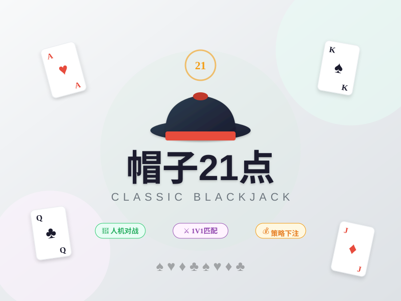

# 🎩 帽子21点

> 多端21点扑克游戏 - 人机对战 + 1V1实时匹配对战



## ✨ 功能特色

- 🤖 **人机对战** - 智能AI对手，随时开局
- ⚔️ **1V1匹配** - 实时匹配真人玩家对战
- 💰 **策略下注** - 支持下注、跟注、加注、梭哈
- 🎯 **经典规则** - 标准21点玩法，Blackjack 1.5倍奖励
- 📱 **多端支持** - Web + 移动端适配
- 🎨 **精美界面** - 浅色主题设计

## 🛠 技术栈

### 前端
- React 18 + Vite
- Socket.IO Client (实时通信)
- Zustand (状态管理)
- 响应式设计，支持Web和移动端

### 后端
- Node.js + Express
- Socket.IO (WebSocket实时通信)
- 自定义21点游戏引擎

## 📁 项目结构

```
maozi-21point/
├── frontend/                # 前端项目
│   ├── src/
│   │   ├── components/      # 组件
│   │   │   ├── Card.jsx     # 扑克牌
│   │   │   ├── Hand.jsx     # 手牌
│   │   │   ├── BettingControls.jsx  # 下注控制
│   │   │   └── GameActions.jsx      # 游戏操作
│   │   ├── screens/         # 页面
│   │   │   ├── HomeScreen.jsx   # 首页
│   │   │   ├── LobbyScreen.jsx  # 大厅
│   │   │   ├── GameScreen.jsx   # 游戏界面
│   │   │   └── WaitingScreen.jsx # 匹配等待
│   │   ├── store/           # 状态管理
│   │   │   └── gameStore.js
│   │   ├── styles/          # 样式
│   │   ├── App.jsx
│   │   └── main.jsx
│   ├── public/              # 静态资源
│   ├── vite.config.js
│   └── package.json
├── backend/                 # 后端项目
│   ├── src/
│   │   ├── game/            # 游戏引擎
│   │   │   ├── Deck.js      # 牌组
│   │   │   ├── GameEngine.js # 游戏引擎
│   │   │   └── AIPlayer.js  # AI玩家
│   │   ├── socket/          # Socket通信
│   │   │   └── gameSocket.js
│   │   └── index.js         # 入口
│   └── package.json
├── .github/workflows/       # GitHub Actions
│   └── deploy.yml           # 自动部署
├── nginx/                   # Nginx配置
│   └── maozi-21point.conf
└── package.json
```

## 🚀 快速开始

### 安装依赖
```bash
npm run install:all
```

### 开发模式
```bash
npm run dev
```
- 前端: http://localhost:60210
- 后端: http://localhost:60215

### 构建生产版本
```bash
npm run build
```

## 🎮 游戏规则

1. **初始金币**：每位玩家1000分
2. **目标**：手牌点数尽量接近21点，但不能超过
3. **点数计算**：
   - 2-10 = 对应点数
   - J/Q/K = 10点
   - A = 1或11点（自动调整）
4. **操作**：
   - 🎯 **要牌**：再拿一张牌
   - ✋ **停牌**：不再要牌
   - 💰 **加倍**：下注翻倍，只再拿一张
   - 🔥 **梭哈**：全部下注
5. **胜负判定**：
   - Blackjack（首两张21点）= 1.5倍奖励
   - 点数大于庄家且≤21 = 赢
   - 点数相同 = 平局（退还下注）
   - 爆牌（>21）= 输

## 🌐 部署

### 服务器信息
- IP: 120.48.13.152
- 用户: root
- 前端端口: 60210
- 后端端口: 60215

### 自动部署
通过 GitHub Actions 自动部署：
1. 设置 Secrets: `SERVER_HOST`, `SERVER_USER`, `SERVER_PASSWORD`
2. 推送代码到 main 分支即可自动部署

### 手动部署
```bash
# 克隆项目
git clone <repo-url> /www/maozi-21point
cd /www/maozi-21point

# 安装依赖
npm run install:all

# 构建前端
npm run build

# 启动后端 (使用PM2)
pm2 start backend/src/index.js --name maozi-21point

# 配置Nginx
sudo cp nginx/maozi-21point.conf /etc/nginx/conf.d/
sudo nginx -t && sudo systemctl reload nginx
```

## 📝 License

MIT License
